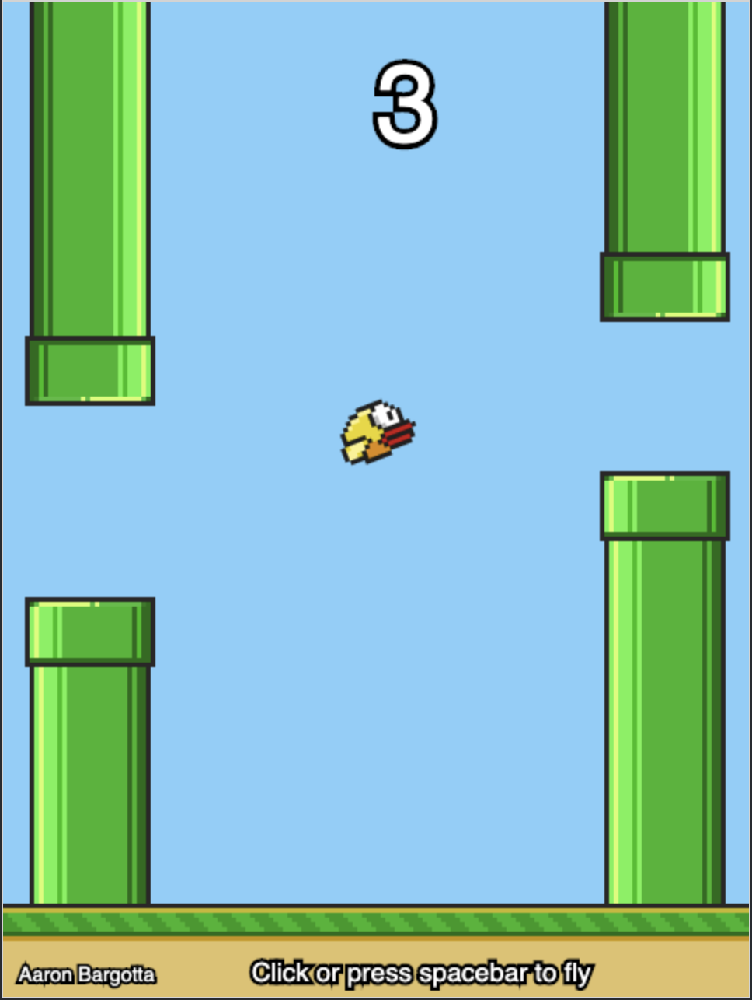
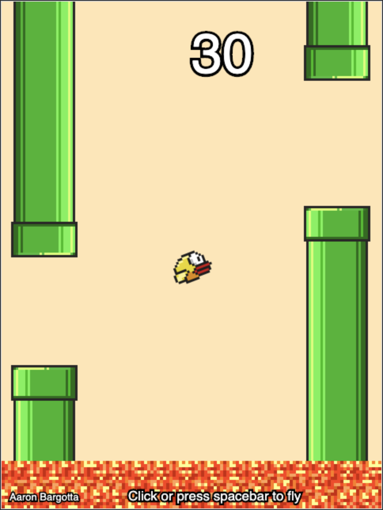
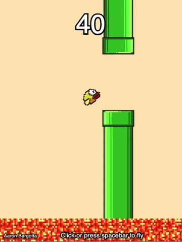

# Flappy Bird AI
My own version of Flappy Bird... with an AI! I originally just intended this to be a super simplified version of the game, using this as a learning exercise in [Canvas](https://developer.mozilla.org/en-US/docs/Web/API/Canvas_API). However, I've since expanded on this project, which includes adding different levels and a neuroevolution artificial intelligence. I am very happy at how this has turned out!

**[See it in action.](https://bargotta.github.io/Flappy-Bird-AI/)**

### Neuroevolution AI
The neuroevolution AI was created using [tensorflow.js](https://www.tensorflow.org/js).

Each bird is given a neural network: its brain. The neural network is fed 5 inputs:

1. The bird's y position.
2. The bird's y velocity.
3. The bird's distance to the nearest obstacles.
4. The y position of the top pipe opening.
5. The y position of the bottom pipe opening.

The network then spits out two outputs: flap or don't flap. This determines the bird's action.
 
Each generation spawns 250 birds based on the previous generation, with generation 0 being randomly generated. During a generation, each bird recieves a fitness score which is based on the progress it made: The better the bird performs, the higher its fitness score. This fitness score determines the probability that the bird's brain (neural network) is passed onto the next generation. Therefore, the better a bird performs, the more likely it is to pass its brain onto the next generation; survival of the fittest anyone? While creating a new generation, there is a 10% chance that a mutation occurs to its brain which enables evolution to occur. And that's it!

Generation 61             |  Generation 120
:-------------------------:|:-------------------------:
  |  

#### Level One
Avoid the pipes.

#### Level Two
Avoid the pipes and floor.

#### Level Three
Pay attention to the moving pipes.

#### Level Four (TODO)
Can you make it through the tunnels in darkness?

#### Hard Mode (TODO)
Avoid the pipes, floor, and don't let your energy bar deplete.
